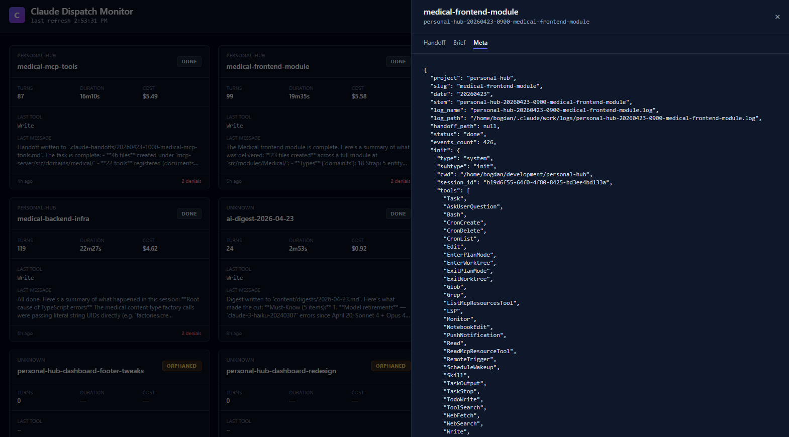

# claude-dispatch-monitor

A small, local web dashboard for monitoring Claude Code **headless** sessions
launched with `claude -p …`.

If you use Claude Code as an agent runner — spawning `claude -p` against a
project in the background and collecting its output — this dashboard gives you
a live view of what every session is doing, how many turns it has burned, how
much it has cost, and what it last did.



## What it reads

- `~/.claude/work/logs/*.log` — the stream-JSON output of each `claude -p` run
- `~/.claude/work/briefs/*.md` — the brief that seeded each run (optional)
- `~/development/*/.claude-handoffs/*.md` — handoffs written by child sessions
  (optional)
- `pgrep -af 'claude -p'` + `/proc/<pid>/cwd` — to detect which sessions are
  currently alive

Nothing is written. The server is read-only.

## What it shows

Per dispatch:

| Field | Source |
|---|---|
| **status** | `running` · `done` · `failed` · `orphaned` |
| **turns** | from `result.num_turns` in the log |
| **duration** | from `result.duration_ms` |
| **cost** | from `result.total_cost_usd` |
| **last tool / message** | last `tool_use` + last assistant text block |
| **denials** | length of `result.permission_denials` |
| **handoff** | whether the project wrote one |

Click a card → drawer with three tabs: **Handoff**, **Brief**, **Meta** (raw
parsed JSON for the dispatch).

## Requirements

- **Node 20 or newer** (there's an `.nvmrc`)
- **Claude Code** — installed and signed in
  ([install docs](https://docs.claude.com/en/docs/claude-code))
- Linux or macOS (the live-process view uses `pgrep` + `/proc`)

Windows works in WSL2.

## Quick start

```bash
git clone https://github.com/bogdanignat/claude-dispatch-monitor
cd claude-dispatch-monitor
npm install
npm run dev
```

Open [http://localhost:5173](http://localhost:5173). Vite serves the UI and
proxies `/api/*` to the Node server on `:3939`.

On first run you'll see **mock data** — a handful of fake dispatches covering
every status. A `MOCK` badge appears in the header. That's the `USE_MOCK=1`
path — it also kicks in automatically whenever `LOGS_DIR` doesn't exist.

Force mock mode even when real data exists:

```bash
USE_MOCK=1 npm run dev
```

## First-time setup (real data)

The monitor reads log files that **you** produce by running `claude -p` with
stream-JSON output. Two small helper scripts are included:

```bash
./scripts/setup.sh      # creates ~/.claude/work/{logs,briefs}
./scripts/dispatch.sh <project> <slug> "<prompt>"
```

Example:

```bash
./scripts/setup.sh
./scripts/dispatch.sh demo-app add-readme \
  "Read the files in this repo and write a one-paragraph README."
```

The dispatch script writes to
`~/.claude/work/logs/demo-app-YYYYMMDD-HHmm-add-readme.log` — a filename the
dashboard can parse. Refresh the UI and the dispatch appears as a card.

### What the script actually does

It's a six-line wrapper around:

```bash
claude -p "<prompt>" --output-format stream-json --verbose \
  > ~/.claude/work/logs/<project>-<YYYYMMDD>-<HHmm>-<slug>.log
```

You don't have to use the script — any `claude -p` invocation that writes a
stream-JSON log to `LOGS_DIR` with a compatible filename works. See
[File format](#file-format) below.

## Production build

```bash
npm run build     # tsc -b && vite build → dist/
npm start         # NODE_ENV=production node server/server.mjs
```

The Node server has **zero runtime dependencies** — it's stdlib only.

## Configuration

All configuration is environment variables. No config files, no secrets.

| Var | Default | Purpose |
|---|---|---|
| `PORT` | `3939` | API server port |
| `LOGS_DIR` | `~/.claude/work/logs` | Where to find dispatch logs |
| `BRIEFS_DIR` | `~/.claude/work/briefs` | Where to find briefs |
| `DEV_ROOT` | `~/development` | Where to scan for `.claude-handoffs/` |
| `USE_MOCK` | `0` | Set to `1` to force fixture data |
| `API_TARGET` | `http://localhost:3939` | Dev-only: vite proxy target |
| `NODE_ENV` | — | Set to `production` to serve `dist/` |

## How it works

```
┌──────────────────────┐
│  Vite dev / dist/    │   React 19 + TanStack Query
│  (frontend)          │   Polls /api/dispatches every 5s
└─────────┬────────────┘
          │ /api/*
          ▼
┌──────────────────────┐
│  server/server.mjs   │   Node 20 stdlib HTTP
│  (zero-dep backend)  │   Parses JSONL logs, pgrep, /proc
└─────────┬────────────┘
          │
          ▼
    ~/.claude/work/logs/
    ~/.claude/work/briefs/
    ~/development/*/.claude-handoffs/
```

## File format

### Log files

**Location:** `LOGS_DIR` (default `~/.claude/work/logs/`)

**Filename:**
```
<project>-<YYYYMMDD>-[<HHmm>-]<slug>.log
```

- `<project>` — any `[A-Za-z0-9._-]+` (hyphens allowed; the parser anchors on
  the 8-digit date)
- `<YYYYMMDD>` — required, 8 digits
- `<HHmm>` — optional 4 digits, lets you dispatch the same slug twice the same
  day
- `<slug>` — any `[A-Za-z0-9._-]+`, short human-readable task name

Examples:

```
demo-20260423-add-tests.log
claude-dispatch-monitor-20260423-0930-readme-polish.log
invoices-api-20260422-1745-pdf-export-bug.log
```

**Content:** one JSON object per line (stream-JSON), the exact format Claude
Code emits when invoked with `--output-format stream-json --verbose`. The
parser reads a subset:

- `system.subtype=init` — captured for metadata
- `assistant.message.content[]` — the `tool_use` blocks feed the "last tool"
  column; `text` blocks feed "last message"
- `result` — `num_turns`, `duration_ms`, `total_cost_usd`, `is_error`,
  `permission_denials[]`

Anything else is ignored, so future Claude Code events don't break the
dashboard.

### Briefs (optional)

**Location:** `BRIEFS_DIR` (default `~/.claude/work/briefs/`)

**Filename:** `<project>-<YYYYMMDD>-[<HHmm>-]<slug>.md` — the **same stem** as
the log, with `.md` instead of `.log`.

The "Brief" drawer tab reads this file when present. Useful if you like to
write down what you asked `claude -p` to do before invoking it.

### Handoffs (optional)

**Location:** `<DEV_ROOT>/<any-project>/.claude-handoffs/<slug>.md`

Default `DEV_ROOT` is `~/development`. The server scans every direct
subdirectory of `DEV_ROOT` for a `.claude-handoffs/` folder and indexes
`<slug>.md` files inside it. If a log with the matching `<slug>` exists, its
card shows a `· handoff` badge and the "Handoff" tab opens the file.

This is a useful convention if you ask `claude -p` to end its session by
writing a summary file — but nothing in the dashboard requires it.

## Project layout

```
.
├── scripts/
│   ├── setup.sh         Creates LOGS_DIR + BRIEFS_DIR, prints next steps
│   └── dispatch.sh      Runs claude -p with a compatible log filename
├── server/              Zero-dep Node HTTP server + log parser
│   ├── server.mjs
│   └── lib/
│       ├── parser.mjs   JSONL parser, liveness detection, handoff lookup
│       ├── parser.test.mjs
│       └── mock.mjs     Fixture data used when LOGS_DIR is missing
├── src/
│   ├── App.tsx
│   ├── main.tsx
│   ├── components/      Shared UI (Header, Drawer, StatusChip)
│   ├── lib/             cn, format helpers, QueryClient
│   └── modules/
│       └── Dispatches/  components, hooks, types, API client
├── index.html
├── vite.config.ts
├── tailwind.config.ts
└── tsconfig.*.json
```

## Tests

```bash
npm test
```

Covers the log-filename parser. The rest is thin glue best exercised by
running the app.

## Troubleshooting

**Nothing shows up, no `MOCK` badge** — `LOGS_DIR` exists but contains no
`.log` files. Run `claude -p …` once with stream-json output redirected there,
or `USE_MOCK=1 npm run dev`.

**Every card says `orphaned`** — the parser couldn't find a `result` event in
the log. That's expected for logs where `claude -p` was killed before it
finished; once a run completes cleanly, the event is written.

**`running` sessions show as `done`** — the dashboard matches live processes by
the brief filename in the `pgrep` output. If you don't dispatch via a brief
file, set `LOGS_DIR` to a directory whose log files are being actively written
to — the dashboard also flags sessions as `running` when the log was modified
in the last 30 seconds.

**Live process detection doesn't work** — you're on a platform without `pgrep`
or without `/proc` (plain macOS has `pgrep` but no `/proc`, so `cwd` detection
is disabled — the rest still works).

**`./scripts/dispatch.sh` says `claude: command not found`** — install
Claude Code and sign in first
([install docs](https://docs.claude.com/en/docs/claude-code)). If `claude`
lives at a non-standard path, set `CLAUDE_BIN=/path/to/claude`.

## What this is **not**

- **Not a controller.** It can't start, stop, or talk to `claude -p`. It only
  watches logs.
- **Not multi-user.** Single local process, no auth.
- **Not a hosted service.** The data it reads is all on the local machine.

## Contributing

Issues and PRs welcome. Keep the spirit: small, local, zero runtime deps on the
server side, no tracking, no build step required for the backend.
